# PetApp
A pet adoption website written in C# using the ASP.NET CORE Framework, Entity Framework and SQL Server.
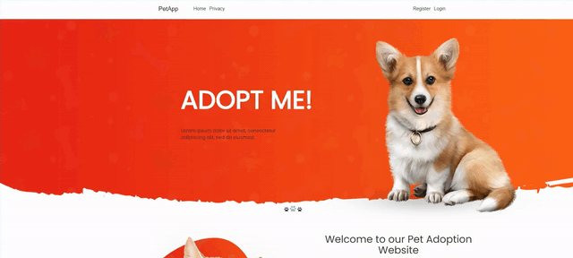

# Main features:

### Browsing through all the animals

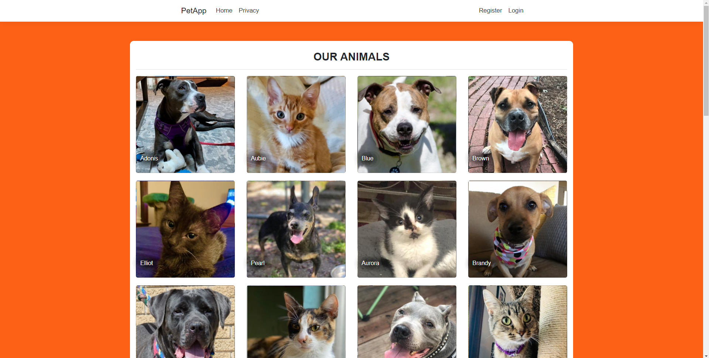

### Browsing through all the shelters

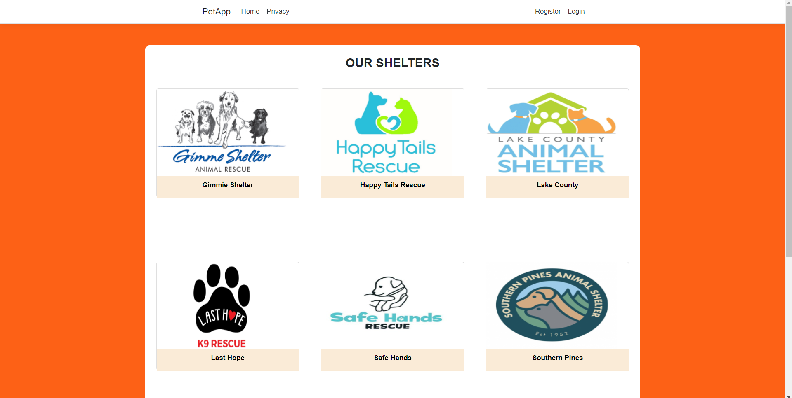

### Registration

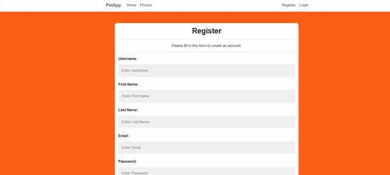

### Shelter Registration

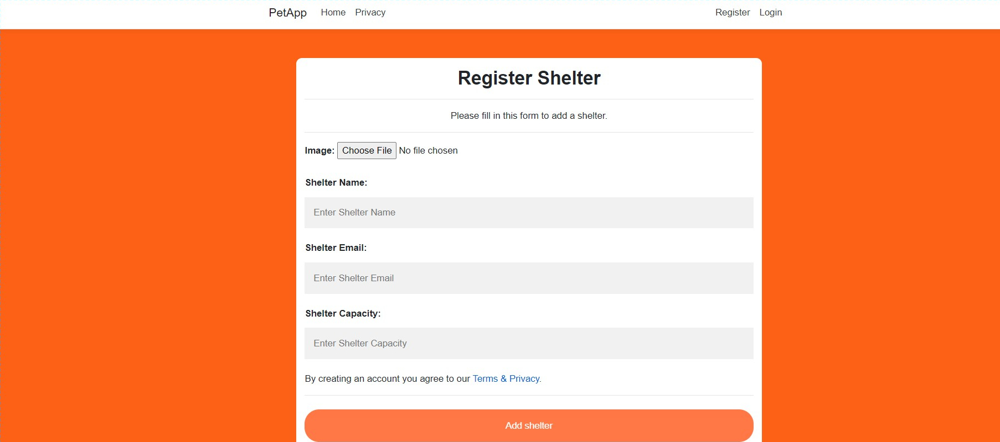

### Login

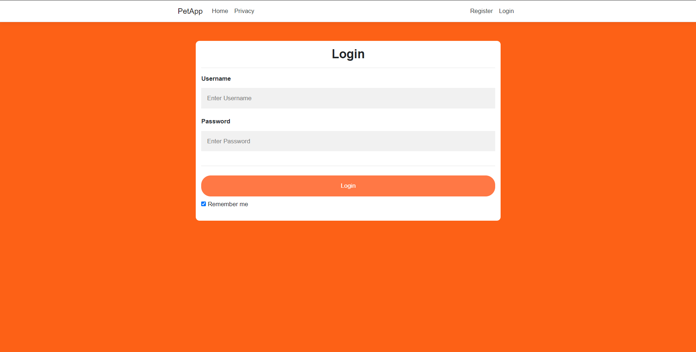

### On the shelter profile page a form to add a new pet to your shelter

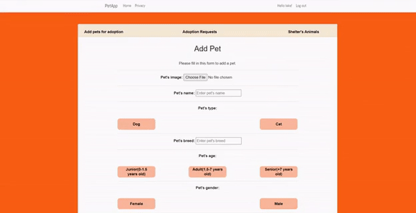

### User profile page with user details

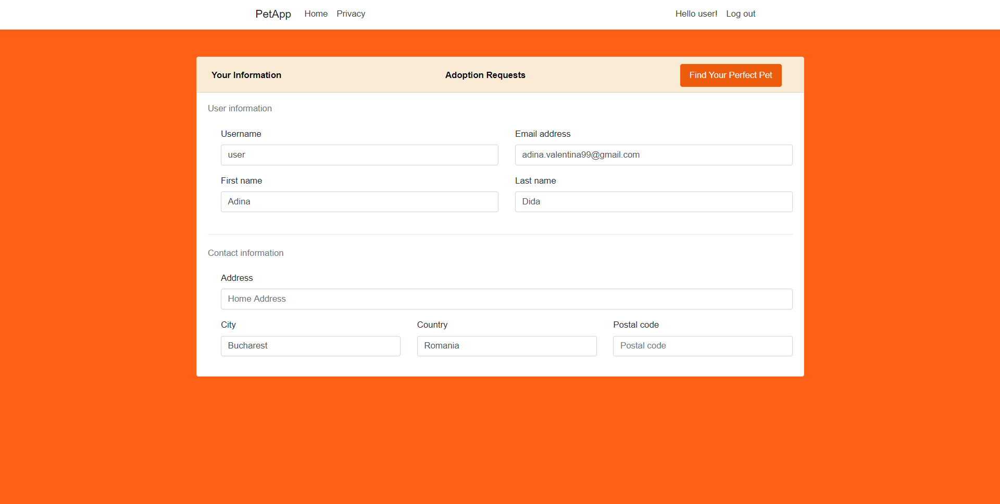

### A quiz to find you perfect pet

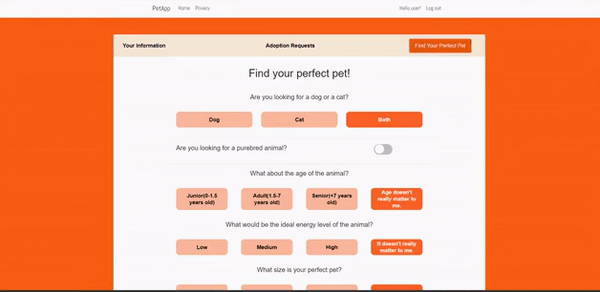

### Favorites functionality

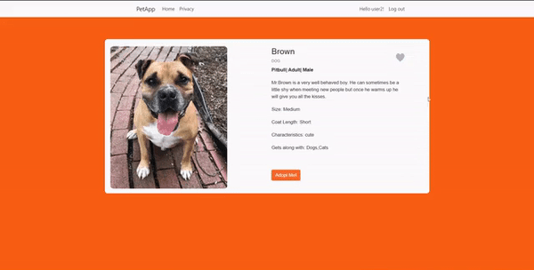

### Favorites page from user profile

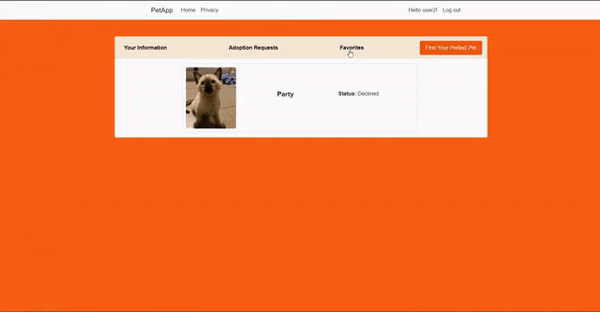

### Animal details page with adoption form

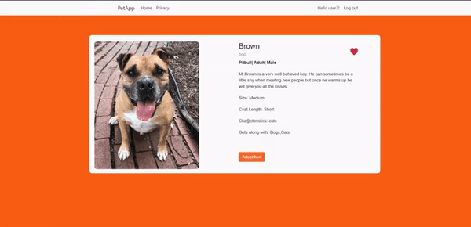

### The adoption requests made appear on the user's profile page and the status updates as the requests are approved or denied

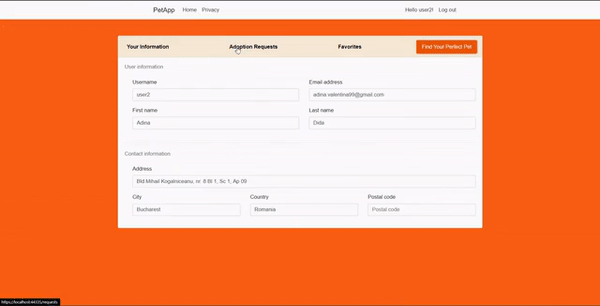

### On the shelter's profile page you can see all the shelter's animal

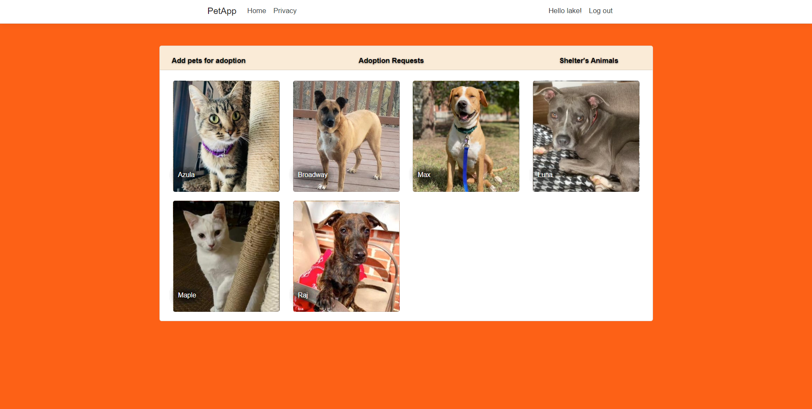

### The shelter can approve or decline the adoption requests placed for its animals

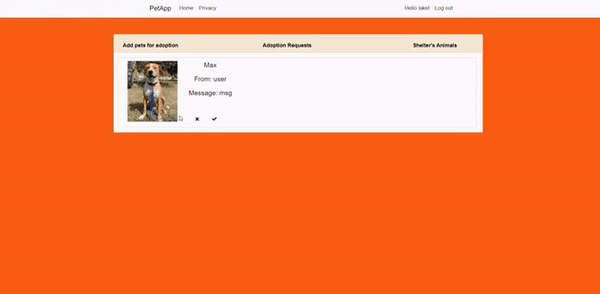

